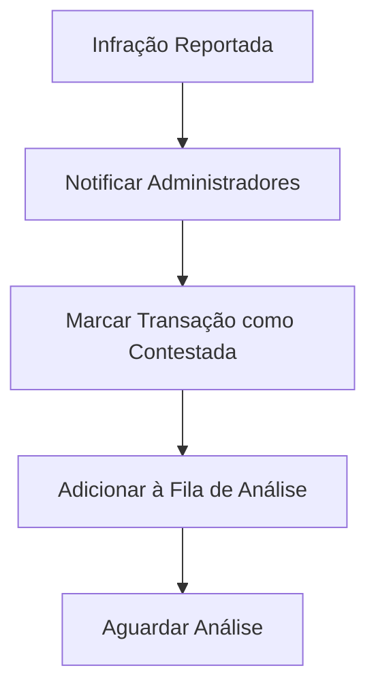
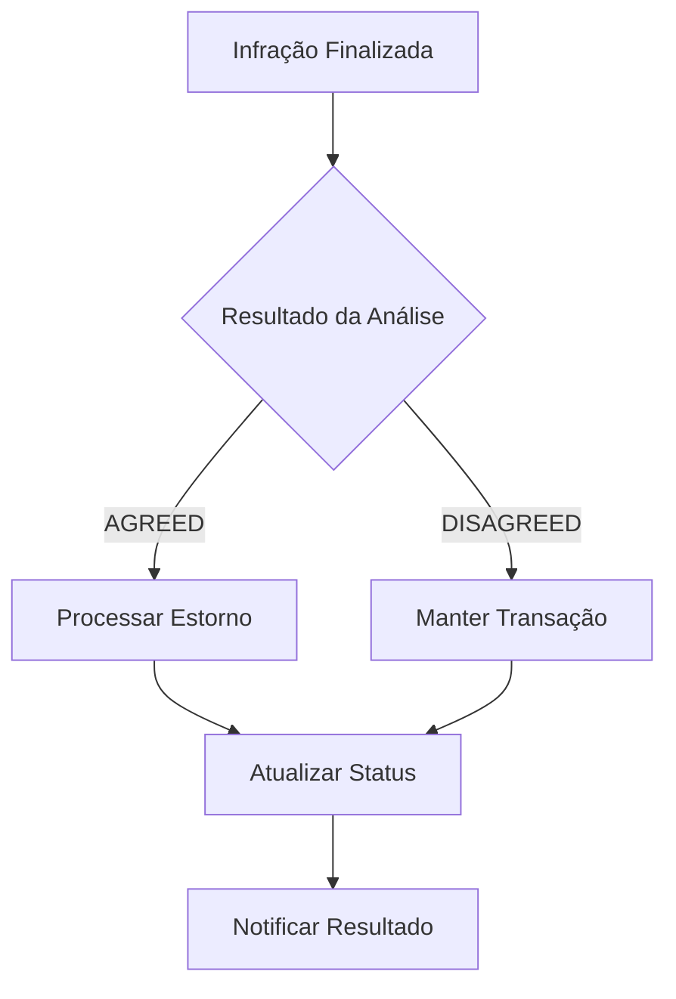

# INFRACTION - Infrações PIX

O webhook **INFRACTION** é enviado quando uma infração PIX é reportada ou finalizada.

## Quando é Enviado

- Infração PIX reportada (status ACKNOWLEDGED)
- Infração PIX finalizada com resultado (status CLOSED)
- Contestação de transação PIX
- Análise de fraude concluída

## Tipos de Infração

<CardGroup cols={2}>
<Card title="Infração Reportada" icon="alert-triangle">
  **Status: ACKNOWLEDGED**
  - Infração reportada pelo pagador
  - Análise em andamento
  - Transação pode ser contestada
</Card>

<Card title="Infração Finalizada" icon="check-circle">
  **Status: CLOSED**
  - Análise concluída
  - Resultado definido (AGREED/DISAGREED)
  - Transação finalizada
</Card>
</CardGroup>

## Payload do Webhook - Infração Reportada

<ResponseExample>
```json
{
  "type": "INFRACTION",
  "data": {
    "id": "infraction_id",
    "type": "REFUND_REQUEST",
    "status": "ACKNOWLEDGED",
    "endToEndId": "E12345678202501191130GHI012",
    "reportedBy": "DEBTOR",
    "creationDate": "2025-01-19T11:30:00.000Z",
    "reportDetails": "Fraude reportada pelo pagador",
    "analysisResult": null,
    "analysisDetails": null,
    "transactionAmount": {
      "amount": "200.00",
      "currency": "BRL"
    },
    "lastModificationDate": "2025-01-19T11:30:00.000Z"
  }
}
```
</ResponseExample>

## Payload do Webhook - Infração Finalizada

<ResponseExample>
```json
{
  "type": "INFRACTION",
  "data": {
    "id": "infraction_id",
    "type": "REFUND_REQUEST",
    "status": "CLOSED",
    "endToEndId": "E12345678202501191145JKL345",
    "reportedBy": "DEBTOR",
    "creationDate": "2025-01-19T11:30:00.000Z",
    "reportDetails": "Fraude confirmada",
    "transactionId": "transaction_id",
    "analysisResult": "AGREED",
    "analysisDetails": "Contestação procedente",
    "transactionAmount": {
      "amount": "200.00",
      "currency": "BRL"
    },
    "lastModificationDate": "2025-01-19T11:45:00.000Z"
  }
}
```
</ResponseExample>

## Campos do Payload

<ParamField body="id" type="string">
  ID único da infração
</ParamField>

<ParamField body="type" type="string">
  Tipo da infração (sempre "REFUND_REQUEST")
</ParamField>

<ParamField body="status" type="string">
  Status da infração (ACKNOWLEDGED ou CLOSED)
</ParamField>

<ParamField body="endToEndId" type="string">
  ID end-to-end da transação contestada
</ParamField>

<ParamField body="reportedBy" type="string">
  Quem reportou a infração (DEBTOR, CREDITOR, etc.)
</ParamField>

<ParamField body="creationDate" type="string">
  Data de criação da infração em ISO 8601
</ParamField>

<ParamField body="reportDetails" type="string">
  Detalhes do relatório de infração
</ParamField>

<ParamField body="analysisResult" type="string">
  Resultado da análise (AGREED, DISAGREED ou null)
</ParamField>

<ParamField body="analysisDetails" type="string">
  Detalhes da análise (null se não finalizada)
</ParamField>

<ParamField body="transactionAmount.amount" type="string">
  Valor da transação contestada
</ParamField>

<ParamField body="transactionAmount.currency" type="string">
  Moeda da transação (sempre "BRL")
</ParamField>

<ParamField body="lastModificationDate" type="string">
  Data da última modificação em ISO 8601
</ParamField>

<ParamField body="transactionId" type="string">
  ID da transação (apenas quando status = CLOSED)
</ParamField>

## Resultados da Análise

<CardGroup cols={2}>
<Card title="AGREED" icon="check">
  **Contestação Procedente**
  - Infração confirmada
  - Valor será estornado
  - Transação revertida
</Card>

<Card title="DISAGREED" icon="x">
  **Contestação Improcedente**
  - Infração rejeitada
  - Valor mantido
  - Transação válida
</Card>
</CardGroup>

## Implementação

### Exemplo em Node.js

```javascript
const express = require('express');
const app = express();

app.use(express.json());

app.post('/webhooks/braix', (req, res) => {
  const { type, data } = req.body;
  
  if (type === 'INFRACTION') {
    handleInfractionWebhook(data);
  }
  
  res.status(200).json({ received: true });
});

function handleInfractionWebhook(data) {
  console.log('Infração processada:', {
    id: data.id,
    status: data.status,
    endToEndId: data.endToEndId,
    reportedBy: data.reportedBy,
    analysisResult: data.analysisResult,
    amount: data.transactionAmount.amount
  });
  
  // Aqui você pode:
  // - Notificar sobre a infração
  // - Atualizar status da transação
  // - Processar estorno se AGREED
  // - Registrar para análise
  // - Etc.
}

app.listen(3000, () => {
  console.log('Webhook server running on port 3000');
});
```

### Exemplo em Python

```python
from flask import Flask, request, jsonify
import json

app = Flask(__name__)

@app.route('/webhooks/braix', methods=['POST'])
def handle_webhook():
    data = request.get_json()
    
    if data.get('type') == 'INFRACTION':
        handle_infraction_webhook(data.get('data'))
    
    return jsonify({'received': True}), 200

def handle_infraction_webhook(data):
    print(f"Infração processada: {json.dumps(data, indent=2)}")
    
    # Aqui você pode:
    # - Notificar sobre a infração
    # - Atualizar status da transação
    # - Processar estorno se AGREED
    # - Registrar para análise
    # - Etc.

if __name__ == '__main__':
    app.run(port=3000)
```

## Casos de Uso Comuns

### 1. Notificar sobre Infração

```javascript
async function handleInfractionWebhook(data) {
  const status = data.status;
  const endToEndId = data.endToEndId;
  const amount = data.transactionAmount.amount;
  
  if (status === 'ACKNOWLEDGED') {
    // Infração reportada
    await sendEmail({
      to: 'admin@example.com',
      subject: 'Infração PIX Reportada',
      body: `Infração reportada para transação ${endToEndId} no valor de R$ ${amount}`
    });
    
    console.log(`Infração reportada: ${endToEndId}`);
  } else if (status === 'CLOSED') {
    // Infração finalizada
    const result = data.analysisResult;
    const details = data.analysisDetails;
    
    await sendEmail({
      to: 'admin@example.com',
      subject: 'Infração PIX Finalizada',
      body: `Infração finalizada: ${result} - ${details}`
    });
    
    console.log(`Infração finalizada: ${result}`);
  }
}
```

### 2. Atualizar Status da Transação

```javascript
async function handleInfractionWebhook(data) {
  const endToEndId = data.endToEndId;
  const status = data.status;
  const analysisResult = data.analysisResult;
  
  if (status === 'ACKNOWLEDGED') {
    // Marcar transação como contestada
    await updateTransactionStatus(endToEndId, 'CONTESTED');
    
    console.log(`Transação ${endToEndId} marcada como contestada`);
  } else if (status === 'CLOSED') {
    // Atualizar status baseado no resultado
    if (analysisResult === 'AGREED') {
      await updateTransactionStatus(endToEndId, 'REFUNDED');
      console.log(`Transação ${endToEndId} marcada como estornada`);
    } else if (analysisResult === 'DISAGREED') {
      await updateTransactionStatus(endToEndId, 'VALIDATED');
      console.log(`Transação ${endToEndId} marcada como validada`);
    }
  }
}
```

### 3. Processar Estorno Automático

```javascript
async function handleInfractionWebhook(data) {
  const status = data.status;
  const analysisResult = data.analysisResult;
  const endToEndId = data.endToEndId;
  const amount = data.transactionAmount.amount;
  
  if (status === 'CLOSED' && analysisResult === 'AGREED') {
    // Processar estorno automático
    const refundResult = await processAutomaticRefund({
      endToEndId,
      amount,
      reason: 'INFRACTION_AGREED',
      infractionId: data.id
    });
    
    if (refundResult.success) {
      console.log(`Estorno automático processado: ${refundResult.refundId}`);
    } else {
      console.error(`Falha no estorno automático: ${refundResult.error}`);
    }
  }
}
```

### 4. Registrar para Análise

```javascript
async function handleInfractionWebhook(data) {
  const infractionData = {
    id: data.id,
    endToEndId: data.endToEndId,
    status: data.status,
    reportedBy: data.reportedBy,
    reportDetails: data.reportDetails,
    amount: data.transactionAmount.amount,
    createdAt: data.creationDate,
    analysisResult: data.analysisResult,
    analysisDetails: data.analysisDetails
  };
  
  // Registrar infração no banco de dados
  await recordInfraction(infractionData);
  
  // Adicionar à fila de análise se necessário
  if (data.status === 'ACKNOWLEDGED') {
    await addToAnalysisQueue(data.id);
  }
  
  console.log(`Infração ${data.id} registrada para análise`);
}
```

## Fluxo de Processamento

### 1. Infração Reportada (ACKNOWLEDGED)



### 2. Infração Finalizada (CLOSED)



## Validação de Segurança

Como o webhook INFRACTION não possui checksum, valide usando outros campos:

```javascript
function validateInfractionWebhook(data) {
  // Validar campos obrigatórios
  if (!data.id || !data.status || !data.endToEndId) {
    console.error('Campos obrigatórios ausentes');
    return false;
  }
  
  // Validar status
  if (!['ACKNOWLEDGED', 'CLOSED'].includes(data.status)) {
    console.error('Status inválido');
    return false;
  }
  
  // Validar análise result se status = CLOSED
  if (data.status === 'CLOSED' && !data.analysisResult) {
    console.error('Analysis result ausente para status CLOSED');
    return false;
  }
  
  return true;
}

function handleInfractionWebhook(data) {
  if (!validateInfractionWebhook(data)) {
    console.error('Webhook INFRACTION inválido');
    return;
  }
  
  // Processar webhook com segurança
  processInfraction(data);
}
```

## Troubleshooting

### Problemas Comuns

<AccordionGroup>
<Accordion title="Webhook não recebido">
  - Verifique se a URL está configurada corretamente no dashboard
  - Confirme se o endpoint está retornando status 200
  - Verifique os logs de retry no dashboard
</Accordion>

<Accordion title="Processamento duplicado">
  - Implemente verificação de idempotência usando o campo `id`
  - Armazene IDs processados para evitar duplicatas
  - Use transações de banco de dados para operações atômicas
</Accordion>

<Accordion title="Falha no estorno automático">
  - Verifique se a transação original existe
  - Confirme se o valor está correto
  - Implemente logs detalhados para debugging
</Accordion>
</AccordionGroup>

## Próximos Passos

- [RECEIVE - Pagamentos Recebidos](/guides/webhooks/receive)
- [TRANSFER - Saques Confirmados](/guides/webhooks/transfer)
- [CASHOUT - Saques Rejeitados](/guides/webhooks/cashout)
- [REFUND - Estornos](/guides/webhooks/refund)
